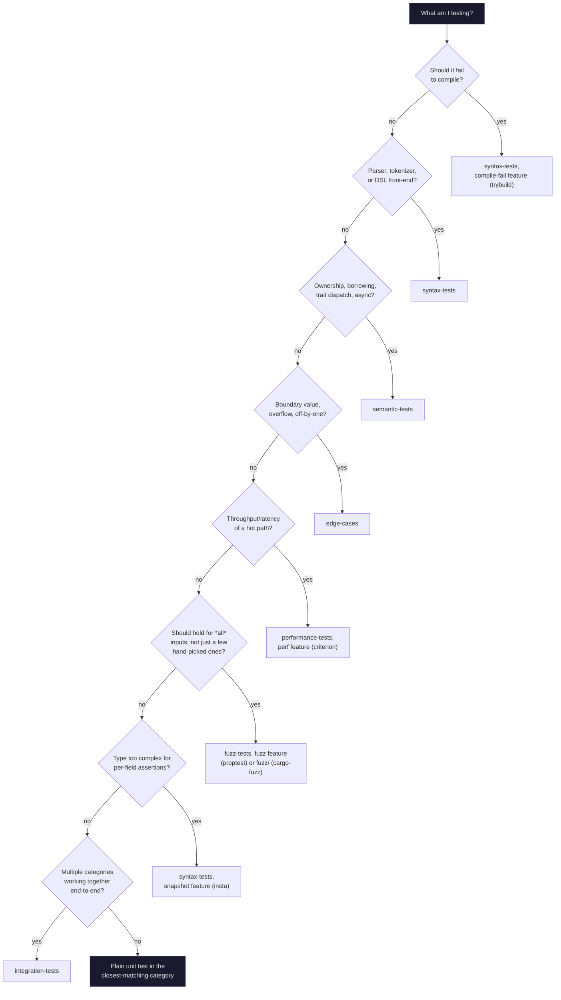

# Adding Tests

A practical guide to the common case: adding a test to an *existing*
category crate. For the rarer case of adding a whole new category crate,
see "Adding a New Test Category" in [`CONTRIBUTING.md`](../CONTRIBUTING.md).

## Where does my test go?

| I want to test... | Category | Example |
| --- | --- | --- |
| A parser, tokenizer, or DSL front-end | `syntax-tests` | `parse_source` in `crates/syntax-tests/src/lib.rs` |
| Something failing to *compile* (not just returning `Err`) | `syntax-tests`, `compile-fail` feature | `crates/syntax-tests/tests/ui/` |
| Ownership, borrowing, trait dispatch, async | `semantic-tests` | `shared_counter_after_workers`, `Greeter` |
| A data race that only shows up under specific thread interleavings | `semantic-tests`, `loom` feature | `loom_tests` module |
| A boundary value, overflow, or off-by-one | `edge-cases` | `safe_truncate`, `overflow_checks` |
| Throughput or latency of a hot path | `performance-tests` | `benches/sum_bench.rs` |
| "never panics on arbitrary input" | `fuzz-tests`, `fuzz` feature (proptest) or `fuzz/` (cargo-fuzz) | `utf8_input` |
| Multiple categories working together end-to-end | `integration-tests` | `tests/e2e.rs` |
| A helper other categories should reuse | `core-tests` | `UserFixture`, `assert_contains` |

If you're not sure, default to a plain unit test in the closest-matching
category — it's cheap to move later.

Same decision, as a flowchart if you'd rather branch than scan the table:



## The six test shapes in this template

### 1. Plain unit test (always available, no extra deps)

```rust
#[cfg(test)]
mod tests {
    use super::*;

    #[test]
    fn my_behavior_holds() {
        assert_eq!(my_function(2), 4);
    }
}
```

This is the default. Every category crate has these, and they run with
`cargo test --workspace` — no feature flag needed.

### 2. Property test (`proptest`, behind `fuzz-tests`' `fuzz` feature)

Use when a plain unit test would only cover a handful of hand-picked
inputs, but the *property* you care about should hold for all inputs. See
`crates/fuzz-tests/src/lib.rs`'s `property_tests` module for the pattern:

```rust
#[cfg(feature = "fuzz")]
mod property_tests {
    use proptest::prelude::*;

    proptest! {
        #[test]
        fn my_property_holds(input in proptest::collection::vec(any::<u8>(), 0..64)) {
            prop_assert!(my_function_never_panics(&input));
        }
    }
}
```

Run it with `cargo test -p fuzz-tests --features fuzz`.

### 3. Compile-fail / UI test (`trybuild`, behind `syntax-tests`' `compile-fail` feature)

Use when the thing under test should fail to *compile*, not just return an
error at runtime — the right tool for testing a macro or a type-level
constraint. See `crates/syntax-tests/tests/compile_fail.rs` and the
fixtures under `crates/syntax-tests/tests/ui/{pass,fail}/`.

1. Add a `.rs` fixture under `tests/ui/pass/` (should compile) or
   `tests/ui/fail/` (should not).
2. Generate its `.stderr` snapshot: `TRYBUILD=overwrite cargo test -p
   syntax-tests --features compile-fail`, then inspect the diff before
   committing it.
3. Keep fixtures minimal and prefer stable, long-standing diagnostics
   (e.g. a basic type mismatch) over anything likely to reword across
   compiler versions — CI only runs this on stable (see
   [`ci/README.md`](../ci/README.md)), but the snapshot still needs to
   stay accurate as the pinned `trybuild`/compiler age.

### 4. Benchmark (`criterion`, behind `performance-tests`' `perf` feature)

Use for throughput/latency-sensitive code where you want a regression
guard, not just correctness. See `crates/performance-tests/benches/sum_bench.rs`.

```rust
use criterion::{criterion_group, criterion_main, BenchmarkId, Criterion};
use std::hint::black_box;

fn my_benchmark(c: &mut Criterion) {
    c.bench_function("my_function", |b| b.iter(|| my_function(black_box(42))));
}

criterion_group!(benches, my_benchmark);
criterion_main!(benches);
```

Run with `cargo bench -p performance-tests --features perf`. Note the
`[[bench]]` entry in `Cargo.toml` needs `required-features = ["perf"]` so
it doesn't force every adopter to pull in Criterion by default.

For a cheaper, dependency-free regression guard that runs under plain
`cargo test`, see the `#[ignore]`d wall-clock check next to `sum_is_correct`
in `crates/performance-tests/src/lib.rs` instead. For statistical
regression detection (is a change actually slower, or just noise?), see
[`docs/performance-regression-testing.md`](performance-regression-testing.md).

### 5. Snapshot test (`insta`, behind `syntax-tests`' `snapshot` feature)

Use when a type has enough fields that per-field assertions get unwieldy
and start hiding the actual diff when something changes — a snapshot
shows the whole shape at once. See `crates/syntax-tests/src/lib.rs`'s
`snapshot_tests` module and `src/snapshots/*.snap`.

```rust
#[cfg(feature = "snapshot")]
mod snapshot_tests {
    #[test]
    fn my_struct_looks_right() {
        insta::assert_debug_snapshot!(build_my_struct());
    }
}
```

1. Install the review tool once: `cargo install cargo-insta --locked`.
2. Write the assertion, then run `cargo insta test` (not plain `cargo
   test` — it won't fail on a new/changed snapshot, it just collects a
   `.snap.new` file for review).
3. Run `cargo insta review` to accept or reject each `.snap.new`
   interactively, then commit the resulting `.snap` file.
4. Plain `cargo test` (what CI runs) *does* fail on a mismatch — `cargo
   insta test` is a local dev convenience, not a different pass/fail rule.

### 6. Concurrency-permutation test (`loom`, behind `semantic-tests`' `loom` feature)

Use when a plain-threaded test like `shared_counter_after_workers` only
checks the interleavings your machine happened to schedule that run — loom
instead exhaustively explores every possible thread interleaving for a
given model, catching races that would otherwise show up as a rare,
hard-to-reproduce CI flake. See `crates/semantic-tests/src/lib.rs`'s
`loom_tests` module.

```rust
#[cfg(feature = "loom")]
mod loom_tests {
    use loom::sync::{Arc, Mutex};
    use loom::thread;

    // A small, separate copy of the pattern under test, rebuilt on loom's
    // own `Arc`/`Mutex`/`thread` — see why below.
    fn my_concurrent_function_loom(n: usize) -> usize {
        /* same logic as the real function, using the loom imports above */
        n
    }

    #[test]
    fn my_concurrent_function_holds_under_all_interleavings() {
        loom::model(|| {
            assert_eq!(my_concurrent_function_loom(2), 2);
        });
    }
}
```

Run with `cargo test -p semantic-tests --features loom` — it has its own
dedicated, stable-only `loom` CI job (see [`ci/README.md`](../ci/README.md))
rather than running in the main matrix, since exhaustive interleaving search
is slower than a normal test run and doesn't need repeating across every
toolchain/OS leg.

Two things this pattern relies on, both visible in `semantic-tests/src/lib.rs`:

- The loom test rebuilds the pattern under test as a **separate, small
  function** using `loom::sync`/`loom::thread`, instead of making the
  production function itself swap to loom's primitives behind the feature
  flag. That swap looks appealing (loom would then exercise the *real*
  function) but it's a trap: Cargo unifies features across a workspace, so
  `cargo test --workspace --all-features` (what `scripts/check.sh` runs)
  would enable `loom` for every crate that depends on `semantic-tests` too
  — including `integration-tests`, which calls the real function directly,
  outside any `loom::model`. loom's primitives panic when used outside a
  model, so that swap breaks every other consumer of the function the
  moment `--all-features` is in play. A small duplicated copy, scoped
  entirely to the `loom_tests` module, avoids the leak.
- Keep the thread/worker count small (2, not the 8 a plain-threaded test
  might use) — loom's state space grows explosively with thread count.

## Reusing fixtures

Don't duplicate fixture/builder code across categories — put it in
`core-tests` and depend on it:

```toml
[dependencies]
core-tests = { path = "../core-tests" }
```

```rust
use core_tests::default_user_fixture;
```

## New dependency? Gate it.

If your test needs a crate beyond the standard library, add it as an
`optional = true` dependency (or, for dev-only tooling, a plain
`[dev-dependencies]` entry — see the comment in
`crates/performance-tests/Cargo.toml` for why dev-dependencies need extra
care) behind a Cargo feature, and check whether the latest release exceeds
the workspace's MSRV — see the "MSRV" section of the root
[`README.md`](../README.md) and [`docs/best-practices.md`](best-practices.md).
