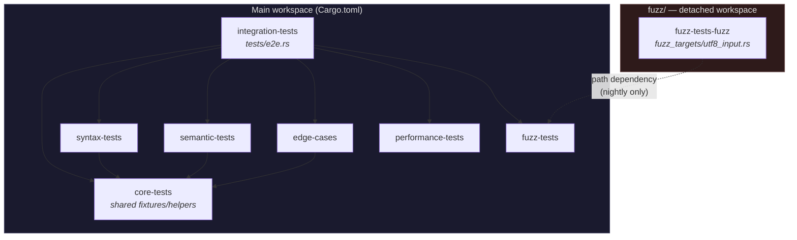
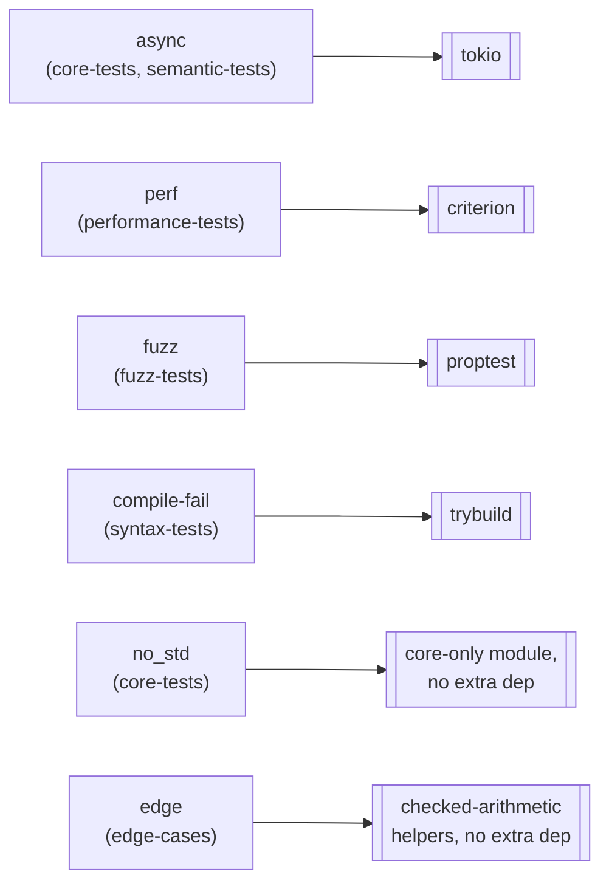
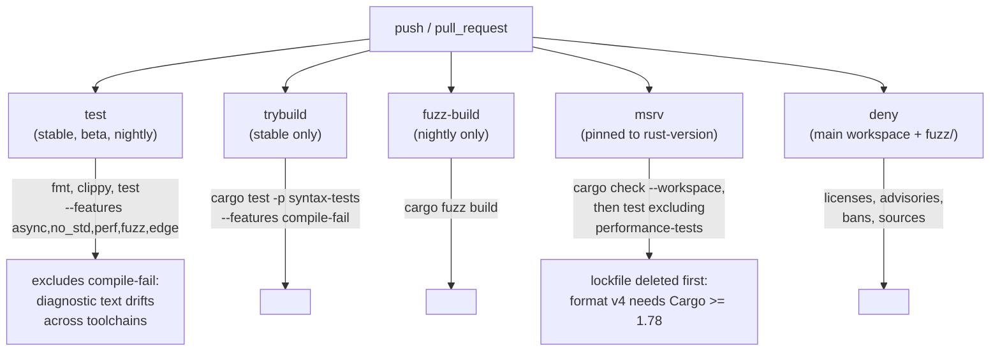

# Architecture

## Workspace shape

RustForge is a **virtual workspace**: the root `Cargo.toml` has no
`[package]` of its own, only `[workspace]` + `[workspace.package]` +
`[workspace.metadata.rustforge]`. That's deliberate — this repo is meant
to be copied into (or have its `crates/` folded into) an adopter's own
workspace, which will supply its own root package.

`fuzz/` is a **second, detached workspace** (its own `[workspace]` table
in `fuzz/Cargo.toml`). `cargo-fuzz` needs nightly and its own dependency
resolution, so it's structurally prevented from ever being pulled into
`cargo build --workspace` / `cargo test --workspace`.

`performance-tests` and `fuzz-tests` have no path dependencies of their
own — they're leaves that `integration-tests` pulls together to
demonstrate cross-category testing (see `crates/integration-tests/tests/e2e.rs`).

## Feature flags as the opt-in mechanism

Every category beyond the default (`syntax`, `semantic`, `integration`)
pulls in real ecosystem tooling *only* when its feature is enabled:

`[workspace.metadata.rustforge]` in the root `Cargo.toml` mirrors this as
`default_categories` / `optional_categories`, using the same names as the
real `--features` flags — see the comment there.

## CI pipeline

Each job is scoped to one concern on purpose — see "Keep CI jobs narrowly
scoped" in [`docs/best-practices.md`](best-practices.md) for why, and
[`ci/README.md`](../ci/README.md) for the full rationale behind each job.

## Why a virtual workspace, not a template with a root package

Adopters fall into two shapes:

1. **New project**: use this repo as a GitHub template directly. The
   virtual workspace becomes their root `Cargo.toml` as-is; they add their
   own crate(s) as additional `members`.
2. **Existing project**: copy `crates/` (and optionally `fuzz/`) into
   their own workspace, merging `members` lists.

A virtual workspace supports both without modification. This is also why
`examples/` at the repo root holds documentation rather than code — see
[`examples/README.md`](../examples/README.md) — and why root-level
`tests/` stays empty until an adopter's own root package exists to own it.
